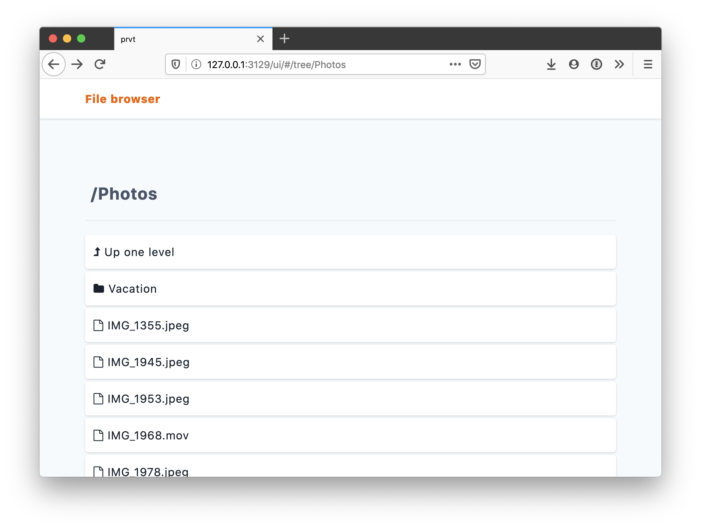

# prvt

prvt lets you store files on the cloud or on local directories, protected with strong end-to-end encryption, and then conveniently view them within a web browser.

With prvt, you can leverage cloud-based object storage (such as AWS S3 or Azure Storage) as a personal, general-purpose cloud storage service, with full end-to-end encryption.

Features:

- Runs on all platforms: Windows, Linux, macOS, and any other platform supported by the Go compiler.
- Uses industry-standard, strong authenticated encryption algorithms.
- Supports storing files on [Azure Blob Storage](https://docs.microsoft.com/en-us/azure/storage/blobs/storage-blobs-overview), [AWS S3](https://aws.amazon.com/s3/), other S3-compatible services, and on a local folder.
- Lets you conveniently browse files using a web browser, displaying supported files (images, videos, PDFs, etc) within the browser itself.
- Supports using GPG keys or security tokens (such as a smart card or a YubiKey) to restrict access to your data.

prvt is free software, released under GNU General Public License version 3.0.



## Installation

## Pre-compiled binaries

The easiest way to install prvt is to download a pre-compiled binary, available for Windows, macOS, and Linux. Check out the [Releases](https://github.com/ItalyPaleAle/prvt/releases) section.

### Running on macOS

The pre-compiled binary is not signed with an Apple developer certificate, and recent versions of macOS will refuse to run it. You can fix this by running:

```sh
# Use the path where you downloaded prvt too
xattr -rc /path/to/prvt
```

## With go get

You can also fetch prvt with `go get`:

```sh
go get -u github.com/ItalyPaleAle/prvt
```

## Using prvt

### Initialize the repository

Before you can use prvt, you need to initialize a repository. This is done with the `prvt initrepo` command:

```sh
prvt initrepo --store <string>
```

You will be prompted to set a passphrase, which will be used to encrypt and decrypt all files.

The store flag tells prvt where to keep your files. It's a string that starts with the name of the store, followed by a provider-specific configuration.

Supported stores at the moment are:

- For **Azure Blob Storage**, use `azure:` followed by the name of the container, for example `azure:myfiles`. The container must already exist. Additionally, set the following environmental variables to authenticate with Azure Storage: `AZURE_STORAGE_ACCOUNT` with the storage account name, and `AZURE_STORAGE_ACCESS_KEY` with the storage account key.
- For **AWS S3**, use `s3:` followed by the name of the bucket, for example `s3:myfiles`. The bucket must already exist. Additionally, set the following environmental variables to authenticate with S3: `AWS_ACCESS_KEY_ID` with the access key id, and `AWS_SECRET_ACCESS_KEY` with the secret access key.
- For other **S3-compatible services**, use the `s3:` prefix and the bucket name, just like for AWS S3, and set the access key id and the secret key with the `AWS_ACCESS_KEY_ID` and `AWS_SECRET_ACCESS_KEY` environmental variables. Next, set the endpoint of the service with the `S3_ENDPOINT` environmental variable (if not set, that defaults to AWS S3 at `s3.amazonaws.com`). By default, prvt uses TLS for accessing S3-compatible services, but that can be disabled by setting the environmental variable `S3_TLS=false`.
- For storing on a **local folder**: use `local:` and the path to the folder (absolute or relative to the current working directory). For example: `local:/path/to/folder` or `local:subfolder-in-cwd`.

For example, to store files locally in a folder called "repo" (in the current working directory):

```sh
prvt initrepo --store local:repo
```

To store on Azure Blob Storage in a storage account called "mystorageacct" and in the "myrepo" container:

```sh
export AZURE_STORAGE_ACCOUNT=mystorageacct
export AZURE_STORAGE_ACCESS_KEY=...
prvt initrepo --store azure:myrepo
```

To store on AWS S3 in a bucket called "mybucket":

```sh
export AWS_ACCESS_KEY_ID=...
export AWS_SECRET_ACCESS_KEY=...
# For using other S3-compatible services, set also `export S3_ENDPOINT=some.service.com`
prvt initrepo --store s3:mybucket
```

### Add files

You can now add files to the repository, using the `prvt add` command:

```sh
prvt add <file> [<file> ...] --store <string> --destination <string>
```

You can add multiple files and folders, which will be added recursively.

The destination flag is required and it's the path in the repo where you want your files to be added; it must begin with a slash (`/`).

For example, to add the folder "photos" from your desktop:

```sh
prvt add ~/photos --store local:repo --destination /
```

### View files in the browser

prvt offers a browser-based interface to view your (encrypted) files, by running a local server. You can start the server with:

```sh
prvt serve --store <string>
```

By default, the server starts at http://127.0.0.1:3129 You can configure what port the server listens on with the `--port` flag. If you want to enable remote clients to access the server, use the `--address 0.0.0.0` flag.

Your browser will try to display supported files within itself, such as photos, supported videos, PDFs, etc. When trying to open other kinds of files, you'll be prompted to download them.

### Delete files from the repo

You can remove files from the repo with:

```sh
prvt rm <path> --store <string>
```

Where the path is the path of the file or folder within the repo. To remove a file, specify its exact path. To remove a folder recursively, specify the name of the folder, ending with `/*`.

For example, to remove a single file:

```sh
prvt rm /photos/IMG_0311.jpeg --store local:repo
```

To remove an entire folder:

```sh
# It's recommended to quote the path to prevent the shell from expanding it
prvt rm "/photos/*" --store local:repo
```

Note: once deleted, files cannot be recovered.

## Using GPG keys

Instead of using passphrases, you can configure a repository to be unlocked with a GPG key. This can be useful in scenarios such as when you want to use prvt in non-interactive scripts, or when you want to use a GPG key stored in a token (such as a smart card or a security key like a YubiKey, etc).

In order to use this mode of operation, you need to have the GPG utility installed (at least version 2), and the `gpg` or `gpg2` command must available in your system's `PATH`. You also need to have a GPG keypair (public and private) available.

To use a GPG key rather than a passphrase, initialize the repository with the `--gpg <address>` flag. The value is the ID or address of a public key in your GPG keyring. For example:

```sh
# Use the address
prvt initrepo --store local:repo --gpg mykey@example.com
# Use the public key ID
prvt initrepo --store local:repo --gpg 0x30F411E2
```

When a repository is initialized with a GPG key, the other commands that need to access (read or update) data, such as `prvt add`, `prvt serve`, and `prvt rm`, will invoke the GPG utility to obtain the master key and unlock the repository. You will need the private key available in the GPG utility for all these operations to succeed.

## FAQ

### How does prvt encrypt my files?

prvt encrypts your files using strong, industry-standard ciphers, such as AES-256-GCM and ChaCha20-Poly1305. The encryption key is derived from the passphrase you choose using Argon2id, or from a key wrapped with GPG.

Check out the [Encryption](./Encryption.md) document for detailed information.

### Does prvt encrypt the names of files and folders?

Yes. prvt stores all encrypted files with a random UUID as name. The name of the file and its directory are only stored in the index file, which is encrypted itself.

### Has the prvt codebase been audited?

The prvt codebase has not been audited yet (and you won't see a "1.0" release until that happens).

However, all the cryptographic operations used by prvt leverage popular, strong ciphers and algorithms such as AES-256-GCM, ChaCha20-Poly1305, and Argon2id. prvt relies on production-ready libraries that implement those algorithms, such as [minio/sio](https://github.com/minio/sio), [google/tink](https://github.com/google/tink), and the Go's standard library. Additionally, prvt can interface with an externally-installed GPG utility if you are initializing a repository with a GPG-wrapped key.

Check out the [Encryption](./Encryption.md) document for detailed information.

### How many files can I store in a repo?

There's no limit on the number of files you can store in a repo.

However, the way the index is implemented relies on a single file, which might make opening or updating the files in a repository slow when you have many (thousands) of files. If you are planning to store a very large number of files, consider splitting them into multiple repositories.
