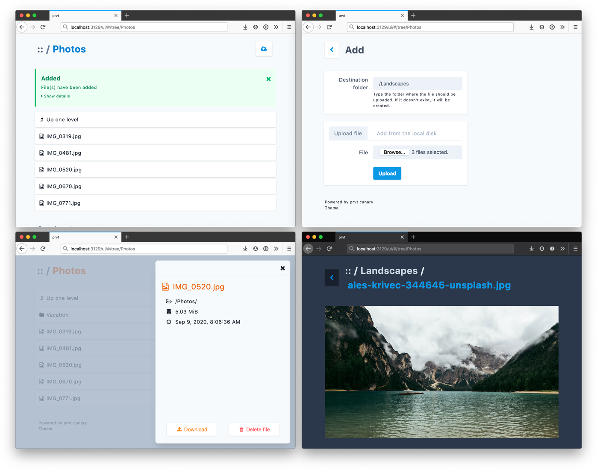

# prvt

[](https://open.vscode.dev/ItalyPaleAle/prvt)

**Personal, end-to-end encrypted cloud storage.**

prvt lets you store files on the cloud or on local directories, protected with strong end-to-end encryption, and then conveniently view them within a web browser. You can leverage cloud-based object storage services (such as AWS S3 or Azure Storage) as a personal, general-purpose cloud storage service, with full end-to-end encryption.

Features:

- Runs on all platforms: Windows, Linux, macOS.
- Uses industry-standard, strong, authenticated encryption algorithms.
- Supports storing files on [Azure Blob Storage](https://docs.microsoft.com/en-us/azure/storage/blobs/storage-blobs-overview), [AWS S3](https://aws.amazon.com/s3/), other S3-compatible services, and on a local folder.
- Conveniently browse files using a web browser, displaying supported files (images, videos, PDFs, etc) within the browser itself.
- Supports optional GPG keys or security tokens (such as a smart card or a YubiKey) to restrict access to your data.

prvt is free software, released under GNU General Public License version 3.0.



# Installation

## Important: do not use go get

**Do not fetch prvt using `go get`!** prvt requires some additional steps to be compiled. See below for [building from source](#building-from-source). 

## Homebrew on macOS

The simplest way to install prvt on macOS is to use the Homebrew package manager. prvt is distributed as a Cask:

```sh
brew cask install italypaleale/tap/prvt
```

## Pre-compiled binaries

You can download a pre-compiled binary for Windows, macOS, and Linux. Check out the [Releases](https://github.com/ItalyPaleAle/prvt/releases) section.

After downloading the archive for your operating system and architecture, extract it and copy the binary anywhere on your system.

> **Note for macOS:** The pre-compiled binary is not signed with an Apple developer certificate, and recent versions of macOS will refuse to run it. You can fix this by running:
>
> ```sh
> # Use the path where you downloaded prvt to
> xattr -rc /path/to/prvt
> ```
>
> This step is not necessary if you're using Homebrew.

# Using prvt

## Initialize the repository

Before you can use prvt, you need to initialize a repository. This is done with the `prvt repo init` command:

```sh
prvt repo init --store <string>
```

You will be prompted to set a passphrase, which will be used to encrypt and decrypt all files.

The store flag tells prvt where to keep your files. It's a string that starts with the name of the store, followed by a provider-specific configuration.

Supported stores at the moment are:

- For **Azure Blob Storage**, use `azure:` followed by the name of the container, for example `azure:myfiles`. The container must already exist. Additionally, set the following environmental variables to authenticate with Azure Storage: `AZURE_STORAGE_ACCOUNT` with the storage account name, and `AZURE_STORAGE_ACCESS_KEY` with the storage account key.
- For **AWS S3**, use `s3:` followed by the name of the bucket, for example `s3:myfiles`. The bucket must already exist. Additionally, set the following environmental variables to authenticate with S3: `AWS_ACCESS_KEY_ID` with the access key id, and `AWS_SECRET_ACCESS_KEY` with the secret access key.
- For other **S3-compatible services**, use the `s3:` prefix and the bucket name, just like for AWS S3, and set the access key id and the secret key with the `AWS_ACCESS_KEY_ID` and `AWS_SECRET_ACCESS_KEY` environmental variables. Next, set the endpoint of the service with the `S3_ENDPOINT` environmental variable (if not set, that defaults to AWS S3 at `s3.amazonaws.com`). By default, prvt uses TLS for accessing S3-compatible services, but that can be disabled by setting the environmental variable `S3_TLS=false`.
- For storing on a **local folder**: use `local:` and the path to the folder (absolute or relative to the current working directory). For example: `local:/path/to/folder` or `local:subfolder-in-cwd`.

For example, to store files locally in a folder called "repo" (in the current working directory):

```sh
prvt repo init --store local:repo
```

To store on Azure Blob Storage in a storage account called "mystorageacct" and in the "myrepo" container:

```sh
export AZURE_STORAGE_ACCOUNT=mystorageacct
export AZURE_STORAGE_ACCESS_KEY=...
prvt repo init --store azure:myrepo
```

To store on AWS S3 in a bucket called "mybucket":

```sh
export AWS_ACCESS_KEY_ID=...
export AWS_SECRET_ACCESS_KEY=...
# For using other S3-compatible services, set also `export S3_ENDPOINT=some.service.com`
prvt repo init --store s3:mybucket
```

## Add files

You can now add files to the repository, using the `prvt add` command:

```sh
prvt add <file> [<file> ...] --store <string> --destination <string>
```

You can add multiple files and folders, which will be added recursively.

The destination flag is required and it's the path in the repository where you want your files to be added; it must begin with a slash (`/`).

For example, to add the folder "photos" from your desktop:

```sh
prvt add ~/photos --store local:repo --destination /
```

## View files in the browser

prvt offers a browser-based interface to view your (encrypted) files, by running a local server. You can start the server with:

```sh
prvt serve --store <string>
```

By default, the server starts at http://127.0.0.1:3129 You can configure what port the server listens on with the `--port` flag. If you want to enable remote clients to access the server, use the `--address 0.0.0.0` flag.

Your browser will try to display supported files within itself, such as photos, supported videos, PDFs, etc. When trying to open other kinds of files, you'll be prompted to download them.

## Delete files from the repository

You can remove files from the repository with:

```sh
prvt rm <path> --store <string>
```

Where the path is the path of the file or folder within the repository. To remove a file, specify its exact path. To remove a folder recursively, specify the name of the folder, ending with `/*`.

For example, to remove a single file:

```sh
prvt rm /photos/IMG_0311.jpeg --store local:repo
```

To remove an entire folder:

```sh
# It's recommended to quote the path to prevent the shell from expanding it
prvt rm "/photos/*" --store local:repo
```

Note: once deleted, files cannot be recovered.

## Using GPG keys

Instead of using passphrases, you can configure a repository to be unlocked with a GPG key. This can be useful in scenarios such as when you want to use prvt in non-interactive scripts, or when you want to use a GPG key stored in a token (such as a smart card or a security key like a YubiKey, etc).

In order to use this mode of operation, you need to have the GPG utility installed (at least version 2), and the `gpg` or `gpg2` command must available in your system's `PATH`. You also need to have a GPG keypair (public and private) available.

To use a GPG key rather than a passphrase, initialize the repository with the `--gpg <address>` flag. The value is the ID or address of a public key in your GPG keyring. For example:

```sh
# Use the address
prvt repo init --store local:repo --gpg mykey@example.com
# Use the public key ID
prvt repo init --store local:repo --gpg 0x30F411E2
```

When a repository is initialized with a GPG key, the other commands that need to access (read or update) data, such as `prvt add`, `prvt serve`, and `prvt rm`, will invoke the GPG utility to obtain the master key and unlock the repository. You will need the private key available in the GPG utility for all these operations to succeed.

## Managing passphrases and keys

You can have multiple passphrases and keys authorized to unlock a repository, and you can rotate them as you wish.

### Adding a passphrase or key

You can add a new passphrase with the following command. It will prompt you to first type the current passphrase, and then a second time to add a new passphrase:

```sh
prvt repo key add --store <string>
```

You can also add a GPG key to a repository:

```sh
prvt repo key add --store <string> --gpg <address>
```

### Listing all passphrases and keys

To list all passphrases and keys authorized to unlock your repository use:

```sh
prvt repo key ls --store <string>
```

Passphrases are identified by their ID and starting with `p:`, for example: `p:59BDDDA8E94EE79F` (these are actually the first 8 bytes of the wrapped/encrypted key). GPG keys are identified by their address.

### Testing and identifying a passphrase or key

You can test if a passphrase or key can unlock a repository and getting its identifier using:

```sh
prvt repo key test --store <string>
```

Using a valid GPG key or a passphrase will unlock the repository, then print the identifier of the key. This can be particularly useful to delete a passphrase or key from the repository.

### Removing a passphrase or key

To remove a passphrase or key, run the following command with the identifier of the passphrase or key:

```sh
prvt repo key ls --store <string> --key <string>
```

## Using environmental variables

You can set pre-defined values with environmental variables to reduce repetitions.

### `PRVT_STORE`

Use the `PRVT_STORE` environmental variable to set a default value for the `--store <string>` flag for all commands that require it.

For example:

```sh
export PRVT_STORE="local:repo"
prvt repo init
```

The value defined with environmental variables acts as a fallback, and you can override it by explicitly set the `--store <string>` flag.

# Building from source

To build prvt from source, you need:

- Go 1.15
- Packr v2 (2.7.1 or higher): https://github.com/gobuffalo/packr/tree/master/v2

After having cloned the repo locally, you can build prvt with a single command:

```sh
make
```

## Development

First build the web UI:

```sh
# Navigate to the ui/ folder
cd ui/

# Install dependencies from NPM
npm ci

# Build for development and start the dev server
npm run dev

# Generate a production build of the web UI
npm run build
```

You can then run prvt by running these commands in the root of the project:

```sh
go run .
```

To build the application and generate a self-contained binary, first you need to run packr2 to embed the web UI into the Go application:

```sh
packr2
go build -o bin
```

# FAQ

### How does prvt encrypt my files?

prvt encrypts your files using strong, industry-standard ciphers, such as AES-256-GCM and ChaCha20-Poly1305. The encryption key is derived from the passphrase you choose using Argon2id, or from a key wrapped with GPG.

Check out the [Encryption](./Encryption.md) document for detailed information.

### Does prvt encrypt the names of files and folders?

Yes. prvt stores all encrypted files with a random UUID as name. The actual path of the file and its directory are only stored in the index file, which is encrypted itself.

### Has the prvt codebase been audited?

The prvt codebase has not been audited yet (and you won't see a "1.0" release until that happens).

However, all the cryptographic operations used by prvt leverage popular, strong ciphers and algorithms such as AES-256-GCM, ChaCha20-Poly1305, and Argon2id. prvt relies on production-ready libraries that implement those algorithms, such as [minio/sio](https://github.com/minio/sio), [google/tink](https://github.com/google/tink), and the Go's standard library. Additionally, prvt can interface with an externally-installed GPG utility if you are initializing a repository with a GPG-wrapped key.

Check out the [Encryption](./Encryption.md) document for detailed information.

### How many files can I store in a repository?

There's no limit on the number of files you can store in a repository.

However, the way the index is implemented relies on a single file, which might make opening or updating the files in a repository slow when you have a lot (many thousands) of files. If you are planning to store a very large number of files, consider splitting them into multiple repositories.

### Can I access the prvt web UI over the network?

Yes, but this is not allowed by default, as the prvt server is listening on 127.0.0.1 only. To connect to a prvt server over the network, set the `--address 0.0.0.0` option for the `prvt serve` command.

Note that prvt is optimized for running on your local machine and does not feature any authentication out-of-the-box. If you expose prvt on the network, anyone can access the files in your repository through the web UI.
